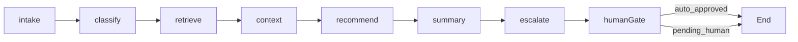

# System Architecture

## Overview

GreenHarvest implements a three-tier architecture: Streamlit presentation layer, LangGraph orchestration layer, and SQLite/CSV data layer. All crop advisory requests flow through a single service entry point (`src/services/support_service.py`) into a deterministic LangGraph workflow.

## Technology stack

| Layer | Component | Location |
|-------|-----------|----------|
| UI | Streamlit role portals | `app.py`, `pages/` |
| Authentication | SQLite users + RBAC | `src/auth/` |
| Orchestration | LangGraph StateGraph | `src/graph/` |
| LLM | OpenAI → Gemini → offline | `src/resilience/llm_router.py` |
| RAG | FAISS + Gemini embeddings | `src/rag/retriever.py` |
| Structured output | Pydantic schemas | `src/chains/schemas.py` |
| Application help | Portal Assistant | `src/helper/` |
| HITL | Staff review workflow | `pages/4_Officer_Human_Review.py` |
| Governance | Audit and guardrails | `src/governance/` |

## LangGraph workflow



### Pipeline nodes

| Node | Responsibility |
|------|----------------|
| `node_intake` | Parse query, load farmer profile, extract entities |
| `node_classify_intent` | Route to advisory category (pest, irrigation, market, etc.) |
| `node_retrieve_knowledge` | FAISS or keyword search over `knowledge_base/` |
| `node_build_context` | Attach weather, soil, market, and history context |
| `node_generate_recommendation` | Grounded LLM response with citations |
| `node_staff_summary` | Generate case summary for field officers |
| `node_escalation_check` | Evaluate confidence and risk for escalation |
| `node_human_review_gate` | Set `auto_approved` or `pending_human` status |

### Integration routing

Market price, weather, soil, and insurance intents receive formatted responses from `src/integrations/` (CSV-backed deterministic data) rather than unconstrained LLM generation.

## Role portals

| Role | Home page | Credentials (demo) |
|------|-----------|---------------------|
| Farmer | `pages/10_Farmer_Home.py` | `farmer_f001` / `farmer123` |
| Field Officer | `pages/20_Officer_Home.py` | `officer1` / `officer2026` |
| Administrator | `pages/30_Admin_Home.py` | `admin` / `admin2026` |

Each role sees only authorized pages via `src/auth/rbac.py` and `src/ui/portal.py`.

## Human-in-the-loop (HITL)

1. Farmer submits a query via **AI Crop Advisor**.
2. Low-confidence or sensitive intents trigger `pending_human` status.
3. Farmer receives a pending notification in **My Queries**.
4. Field officer reviews, edits, or approves on **Human Review**.
5. Approved answer is delivered to the farmer in their preferred language.

## Data flow

```
pages/2_Farmer_AI_Advisor.py
    → src/ui/chat_ui.py
    → src/services/support_service.py
    → src/graph/workflow.py
    → src/rag/retriever.py + src/integrations/*
    → data/greenharvest.db
```

Portal Assistant (application help) uses a separate, lightweight path:

```
src/ui/guide_chat.py → src/helper/assistant.py
```

## Resilience

See [RESILIENCE.md](RESILIENCE.md) for LLM fallback tiers, RAG modes, and safe-pipeline error handling.

## Verification

```powershell
python scripts/init_db.py
python scripts/verify_auth.py
python scripts/ingest_kb.py
python scripts/smoke_test.py
```
